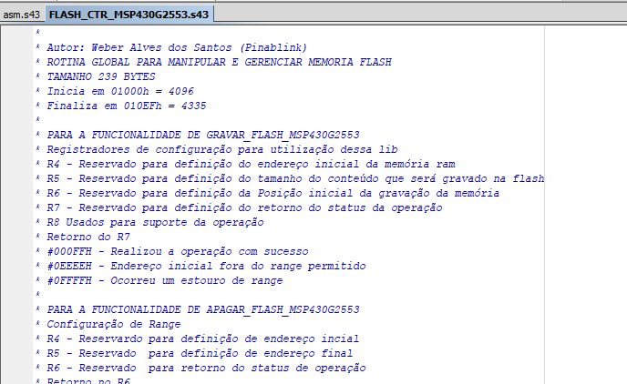
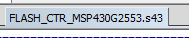
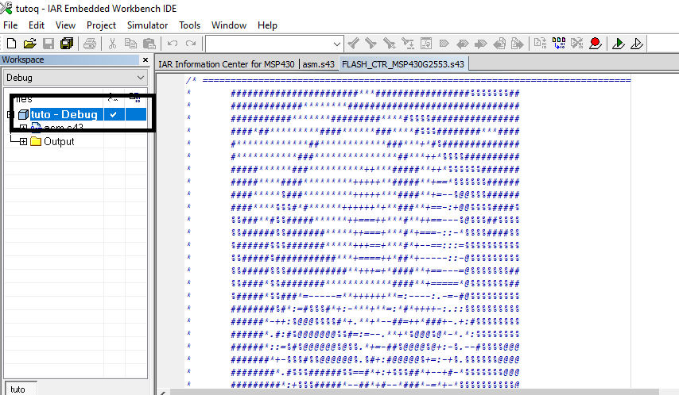
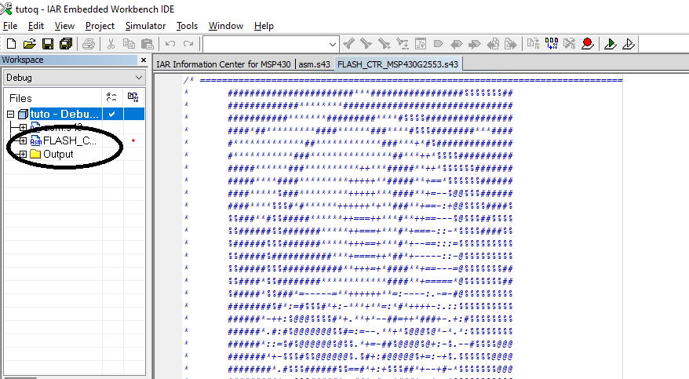
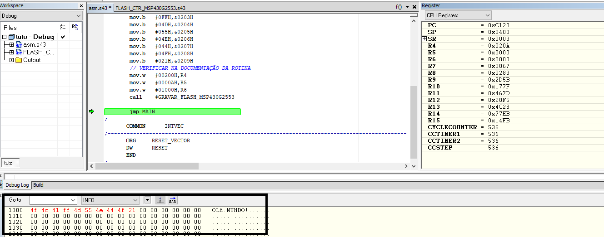

# H-MSP430G2553

### 🤷‍♀️ O que é isso??

Aqui nesse espaço vou disponibilizar pedaços de códigos em ASM para que possa ser utilizado em seus projetos, caso necessite. Ou apenas ler... O código foi construído e executado na ferramenta IAR 5.52.1 e a Plataforma de Testes é um MSP-EXP430G2. Você também pode usar a opção de Simulação caso não queira aplicar a nenhum hardware.
 

## Como utilizar as libs

### FLASH_CTR_MSP430G2553

Esse módulo, disponibiliza rotinas para você maninpular a memória Flash do seu Hardware. A forma como deve ser utilizado está descrito no cabeçalho do arquivo.

👇👇
</br>

</br>
Abra o arquivo FLASH_CTR_MSP430G2553.s43 no seu projeto.

O fonte já deverá abrir na sua janela de edição como abaixo.
👇👇
</br>

</br>

Agora é necessário adicionar o código ao projeto para que você possa exportar.

Clique com o botão direiro na estrutura principal do seu projeto. Selecione a opção Add. Em seguida selecione o Add "FLASH_CTR_MSP430G2553.s43". 

👇👇
</br>

</br>

A estrutura do seu projeto vai atualizar com o novo arquivo. 
👇👇
</br>

</br>

Agora você pode conferir no arquivo FLASH_CTR_MSP430G2553.s43 quais são as Rotinas Públicas que pode ser utilizado e exportar no seu código fonte principal.
Observe abaixo a chamada EXTERN

```

#include "msp430g2553.h"                  

        NAME    main                    
        PUBLIC  MAIN 
        EXTERN GRAVAR_FLASH_MSP430G2553                                        
        RSEG    CSTACK                  
        RSEG    CODE                    

RESET:  mov     #SFE(CSTACK), SP
        mov.w   #WDTPW+WDTHOLD,&WDTCTL
MAIN:   nop                      
        jmp MAIN                           

       COMMON      INTVEC

       ORG     RESET_VECTOR
       DW      RESET
       END

```

Vamos adicionar um Ola Mundo!, e registrar na Memória Flash utilizando a rotina incluída.

```
        // DISPONIBILIZANDO A INFORMAÇÃO NA MEMÓRIA RAM
MAIN:   mov.b   #04FH,&0200H  
        mov.b   #04CH,&0201H
        mov.b   #041H,&0202H
        mov.b   #0FFH,&0203H
        mov.b   #04DH,&0204H
        mov.b   #055H,&0205H
        mov.b   #04EH,&0206H
        mov.b   #044H,&0207H
        mov.b   #04FH,&0208H
        mov.b   #021H,&0209H

```

Adicionando os dados da memória ram na memória flash

```
// VERIFICAR NA DOCUMENTAÇÃO DA ROTINA
        mov.w   #00200H,R4
        mov.w   #0000AH,R5
        mov.w   #01000H,R6
        call    #GRAVAR_FLASH_MSP430G2553

```

Em modo Debug, mesmo como simulador você pode observar o funcionamento. Veja na Sessão Memory a informação gravada na memória.

</br>

</br>


⚠ Importante ⚠

Em modo simulador, assim que você concluir o Debug, a informação será perdida. Para atestar o funcionamento, é necessário executar no hardware em modo debugger.


### CONFIG_CLOCK_MSP430G2553

Esse módulo, disponibiliza rotinas para configuração e manutenção orientado ao tempo de processamento.

### CONFIG_UART_MSP430G2553

Esse módulo, disponibiliza rotinas para configuração de comunicação UART do seu software.
